# ChatGPT Pong

ChatGPT Pong is a simple and fun game of pong, played within a canvas element. The game features retro graphics and a smooth gameplay experience, and is easy to learn but challenging to master.

## Demo

You can try out ChatGPT Pong on CodePen here:

https://codepen.io/pdparchitect/pen/dyKgQRo

## About

In ChatGPT Pong, you control the left paddle and compete against the CPU, which controls the right paddle. The goal of the game is to score more points than your opponent by hitting the ball with your paddle and preventing it from hitting the edge of your side of the field.

The game is played within a 480x360 resolution canvas, and uses retro-looking graphics and sounds to create an authentic arcade experience. The game is written in JavaScript, and is easy to customize and extend with additional features and gameplay mechanics.

ChatGPT Pong was created entirely by the ChatGPT OpenAI system, using its advanced natural language processing capabilities and extensive knowledge of programming and game development.

Here is behind the scenes footage of how it was done:

| Screenshot | Screenshot | Screenshot | Screenshot |
|------------|------------|------------|------------|
| 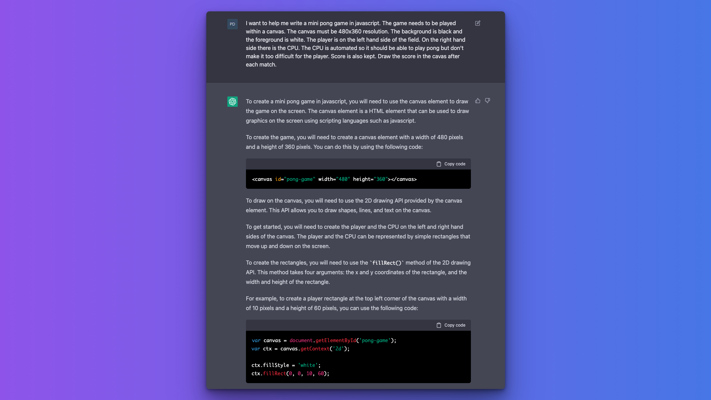 | 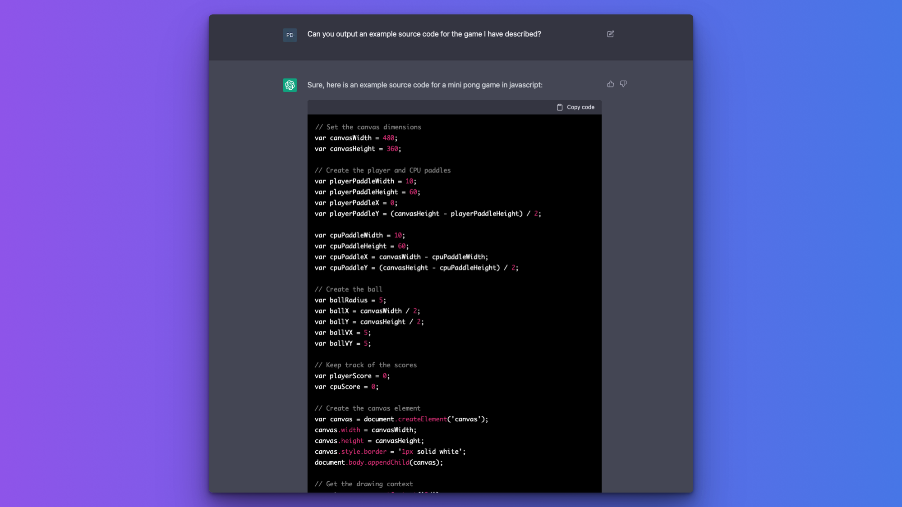 | 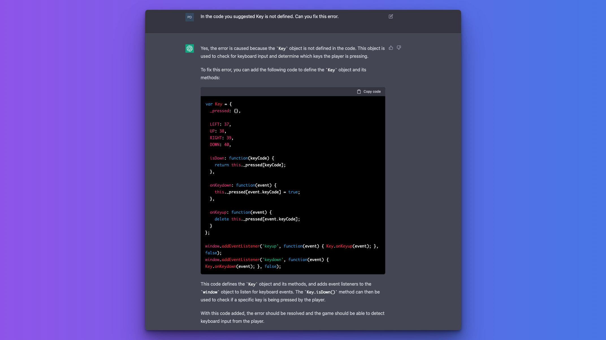 | 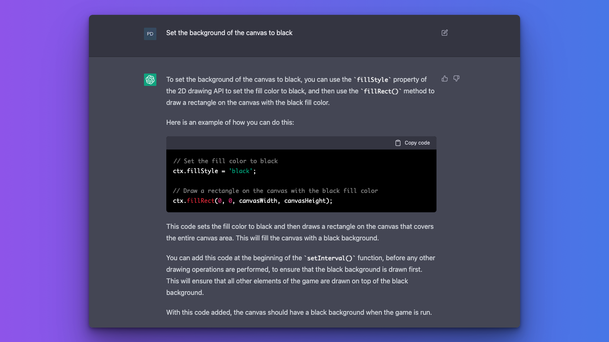 |
| 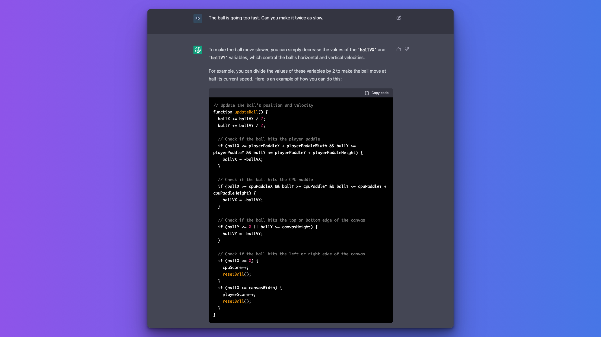 | 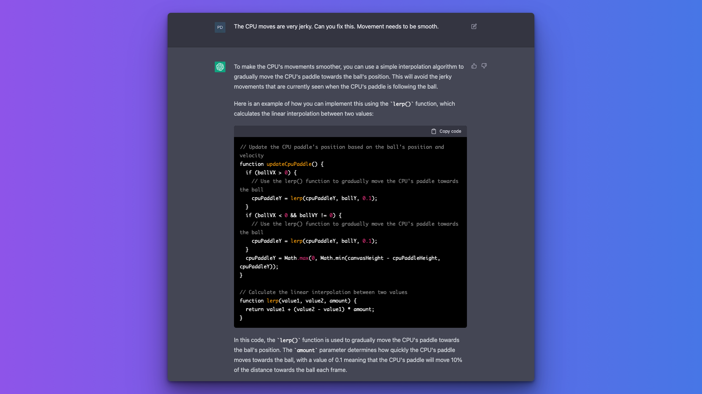 | 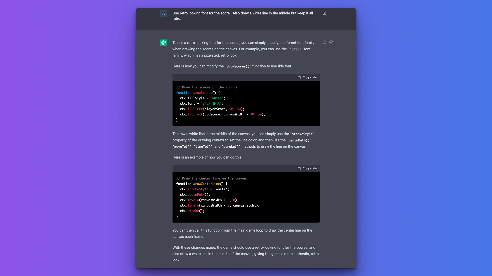 | 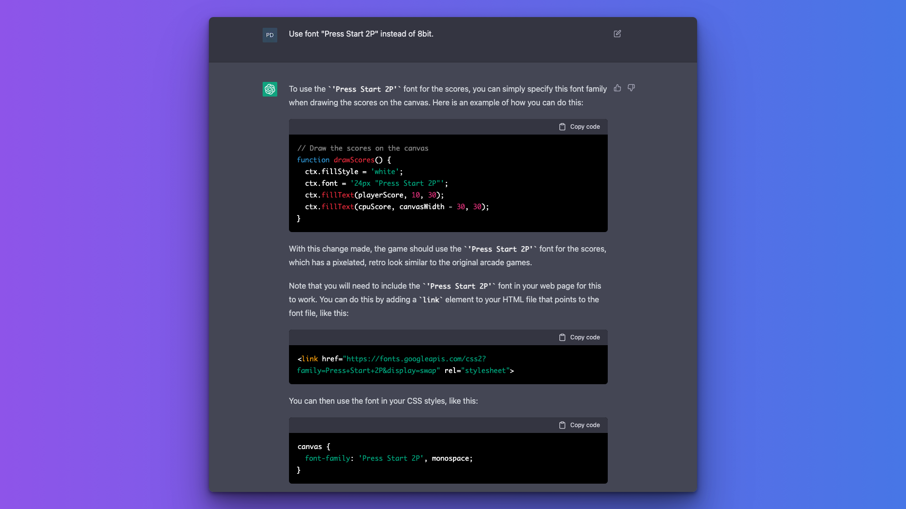 |
| 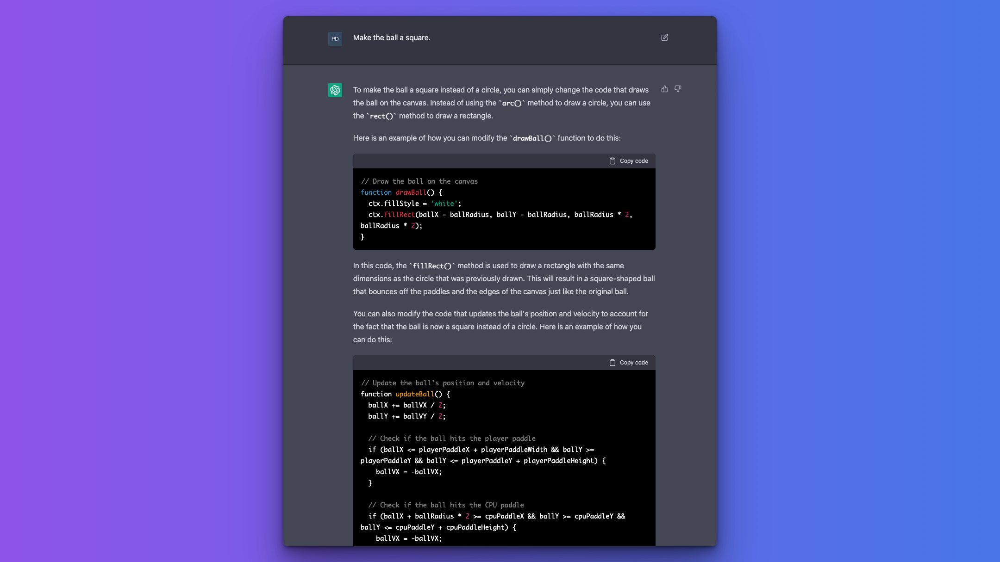 | 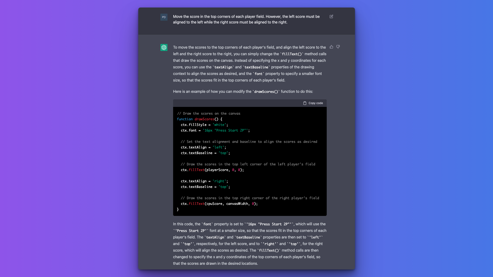 | 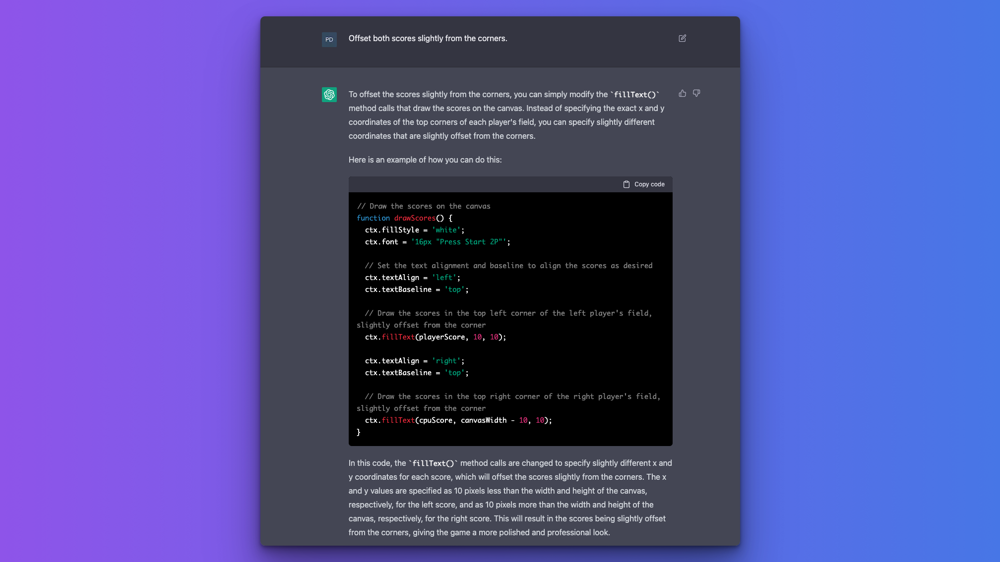 | 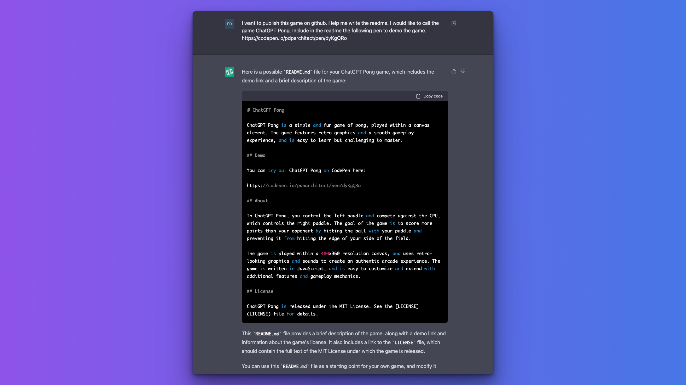 |
| 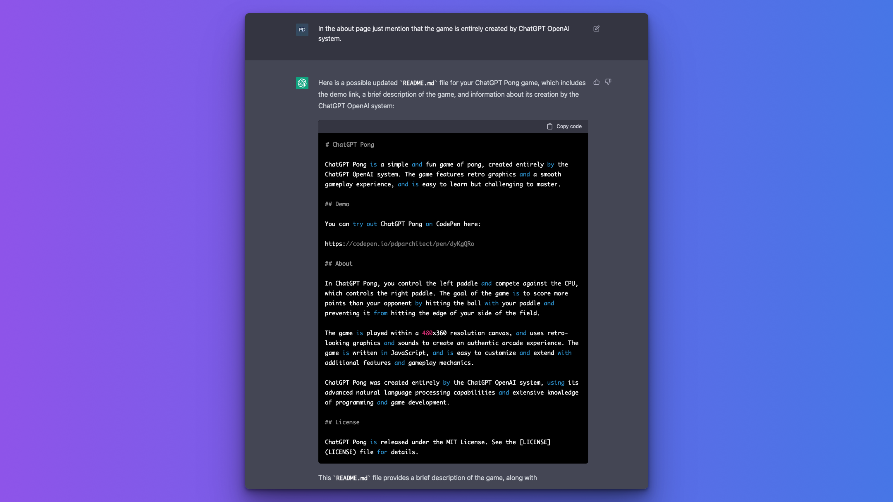 | 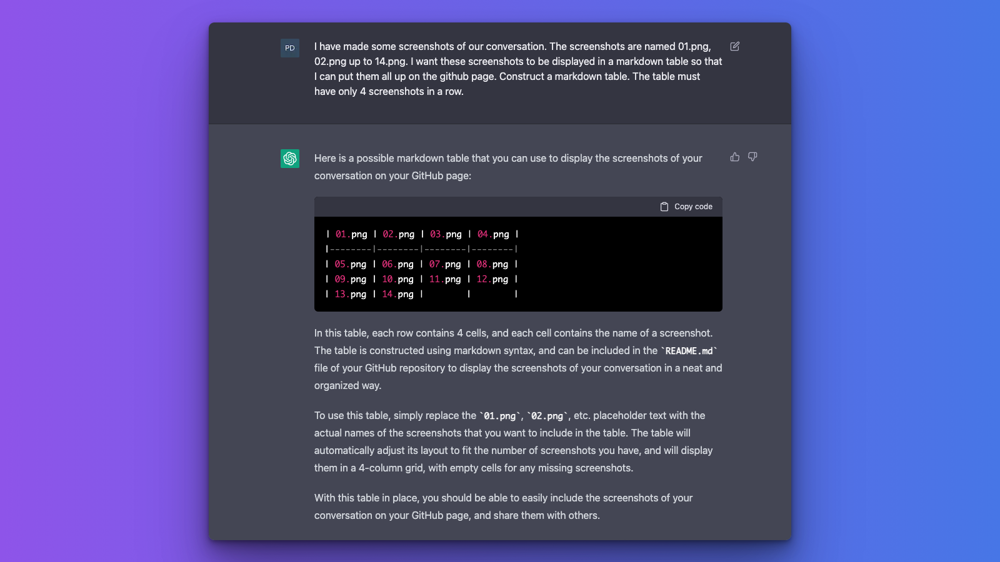 |            |            |

## License

ChatGPT Pong is released under the MIT License. See the [LICENSE](LICENSE) file for details.
